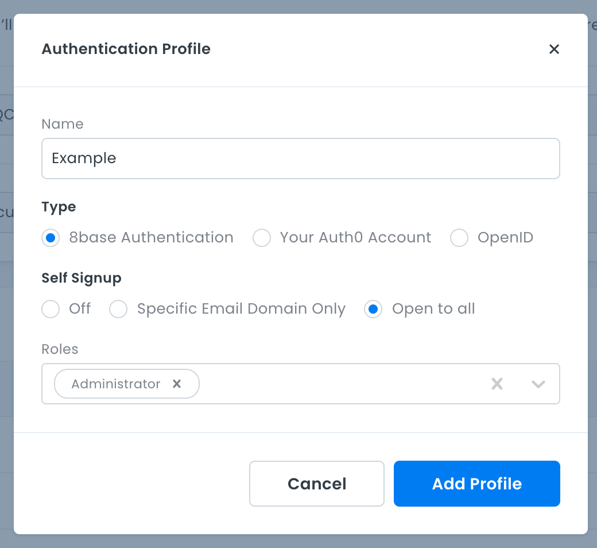
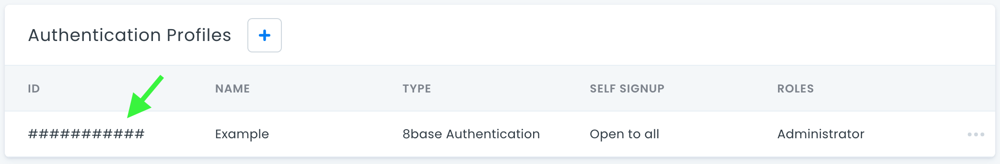

# 8base Auth

Minimal example showing authentication using 8base `userSignUpWithPassword` and `userLogin` mutations.

Currently throws an error - [See this thread for more info](https://community.8base.com/t/unknown-iss-claim-in-authorization-token-error-with-8base-auth/400/8).

## Get Started

1. Clone/Download this repo to your computer.

2. In the terminal go to the root of this project and run `npm install` to install the project dependencies.

3. Create an 8base account and workspace if you don't have one already.

4. Copy the 8base API Endpoint from the 8base workspace home screen and paste into line 1 of the `src/lib/constants.js` file.

```js
// src/lib/constants.js
export const API_ENDPOINT = 'https://api.8base.com/#####'
...
```

5. Back in the 8base, click on "App Services" in the side bar, then "Authentication" in the sub menu.

6. Click the plus button to add a new Authentication Profile and fill out the form as seen below and click the "Add Profile" button.



7. Copy your Authentication profile ID from the table



8. Paste your Authentication profile ID into line 2 of the `src/lib/constants.js` file.

```js
// src/lib/constants.js
...
export const AUTH_PROFILE_ID = '###########'
```

9. Back in the terminal run `npm run start` to start the app. It will launch a new browser window at [http://localhost:3000/](http://localhost:3000/).

10. Fill out the "Sign up" form hit click the "Sign Up" button.

**Expected Result**

You should see your user info displayed.

**Actual Result**

Throws error:

```
Unknown iss claim in authorization token. Unable to find authentication profile with discovery endpoint https://8baseapp.auth0.com/.
```
